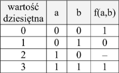
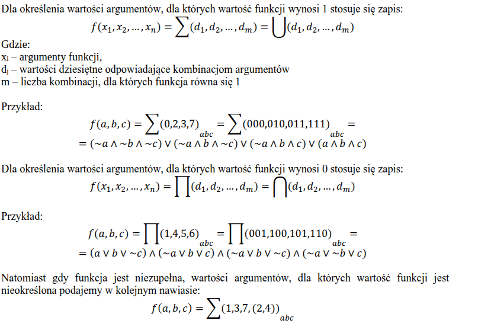
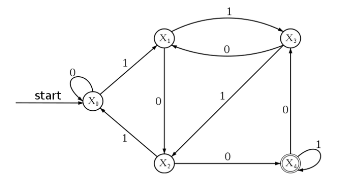

# Obrona

## 1. Podstawowe układy cyfrowe: bramki logiczne, przełączniki, układy sekwencyjne

Układy cyfrowe to zbiór połączonych elementów elektronicznych, w którym informacje reprezentowane są w sposób binarny. Jeśli chodzi o binarność stanu, to ma on dwa stany: stan wysoki (1 lub H), oznaczający potencjał względem masy bliski napięciu zasilania, i stan niski (0 lub L), potencjał względem masy bliski 0V. W logice stan wysoki reprezentowałby prawdę, a niski fałsz.

Do obliczeń można wykorzystać algebrę boole'a, z oczywistymi przykładami, jak

1 ∧ 0 = 0
1 ∨ 0 = 0

Zasady:

A ∧ A = A
A ∨ A = A
A ∧ (A ∨ B) = A ∧ B

lub zapis
AB = A ∧ B
A + B = A ∨ B

Przykładowe bramki:

AND = A ∧ B
OR = A ∨ B
NOT = !A
XOR = (A ∨ B) ∧ !(A ∧ B)
NOR = !(A ∨ B) odwrotność OR
NAND = !(A ∧ B) odwrotność AND
XNOR = (A ∧ B) ∨ (!A ∧ !B)

Bramki Nxyz działają jak bramki xyz, ale z negacją wyjścia

Przełączniki to urządzenia wejścia - elementy mechaniczne lub elektromechaniczne.
Niektóre utrzymują swój stan (stabilne - np. przełącznik światła nie zmienia sam stanu), a inne, jak klawisze klawiatury (chwilowe), wracają do domyślnego stanu.

Ze względu na inercyjność, rozróżniamy układy na kombinacyjne i sekwencyjne.
W układach sekwencyjnych wyjścia w nich zależą nie tylko od wejść, ale też od wewnętrznego stanu.
A w kombinacyjnych, wyjścia zależą bezpośrednio od wejść (funkcja wejść na wyjścia).

Przerzutniki - układy sekwencyjne, które są w stanie zapamiętać stan i przekazać go dalej. Czyli nie są prostą funkcją wejść na wyjścia, bo do takiej funkcji jako argument trzeba dołączyć ich aktualny stan. Czyli posiadają wewnętrzny stan, który może zmieniać się w czasie i wpływa na działanie takiego układu (wyjście będzie rózne dla tych samych wejść przy różnych stanach)

Przykłady:

Przerzutnik RS (flip flop) - wejścia SR, wyjścia Q i !Q
Bardzo prosty i asynchroniczny (czyli nie wymaga obecności zegara)\
S ustawia stan układu (Q) na wysoki dla S = 1\
R ustawia stan układu na niski dla R = 1\
Dla S i R = 0 stan pozostaje taki sam, czyli Q[n] = Q[n-1]\
Dla S i R = 1 stan nie jest zdefiniowany (może być losowy przez sprzeczność logiczną układu)
Przerzutnik JK flip flop to prawie przerzutnik SR, różni się tym, że dla J i K = 1 => Q = !Q

Przerzutniki D (Delay) flip flop i T (Toggle) flip flop - podstawowe przerzutniki synchroniczne. Wymagają sygnału zegara do ustawiania stanu. Dzięki temu ograniczone są zakłócenia ze strony danych wejściowych (debouncing)
Delay: ustawia Q=D, gdy CLK ma stan opadający lub narastający. Korzysta wewnętrznie z SR flip flop
Toggle: ustawia Q=!Q, gdy T=1 i CLK ma stan opadający lub narastający

Inne układy sekwencyjne to na przykład:
Licznik, który liczy liczbę zmian sygnału wejściowego
Rejestr, który przechowuje wartość bitu

Przykładami układów kombinacyjnych są:
Komparator, który zwraca, który z sygnałów jest większy, czy też są równe (taki if)
Multiplekser, który przekazuje jedno z wejść na wyjście w zależności od wejścia sterującego (taki switch)

Hazard to zjawisko, gdzie wynik układu może być chwilowo niepoprawny przez nienatychmiastową naturę prądu. Można walczyć z tym zjawiskiem wykorzystując zegar (układy synchroniczne) lub przez wprowadzenie redundancji elementów.

## 2. Arytmetyka dwójkowa, funkcje boolowskie, tablice Karnaugh

Arytmetyka dwójkowa dotyczy arytmetyki na liczbach o bazie 2, czyli cyfry to tylko 0 lub 1. Liczby konstruuje się analogicznie do bazy dziesiętnej, gdzie każda ważniejsza cyfra ma bazę razy większą wagę (czyli w przypadku dwójkowego 2 razy większą).

Dodawanie, odejmowanie, dzielenie i mnożenie można rozpisać przy dokładnie tym samym algorytmie jak dla operacji pisemnych w systemie dziesiętnym. Czyli

```txt
  1
  1 +
---
  2
---
1 0
```

itd.

Arytmetyka dwójkowa jest wykorzystywana w elektronice, i przez to w komputerach, z racji prostego wykrywania stanu 0 a 1 (reprezentowane przez potencjał względem masy zbliżonym do 0 dla 0 i potencjale względem masy zbliżonym do napięcia zasilania dla 1)

Naturalny kod binarny NKB - liczby są zapisywane w formie słów o konkretnej długości, np. 8, co oznacza, że liczbę np. 115 (1110011[2])zapisałoby się jako 01110011, dopełniając po lewej zera, aby słowo miało tą długość. Wtedy długość słowa określa przedział możliwych do reprezentacji liczb w zbiorze N + <1;2^N>

Kod dwójkowo-dziesiętny - reprezentacja osobno każdej cyfry w liczbie dziesiętnej słowami o długości 4 (bo 2^4>9). Niektóre wartości np. 1111 są niemożliwe, przez co występuje redundancja (nadmiarowość). Wg. mnie naturalnie przekłada się to w system 16stkowy, gdzie 10=A, 15=F.

Funkcje boolowskie: funkcje o n argumentach 0 lub 1 i o 1 wyjściu równym 0 lub 1. Układy elektroniczne realizujące funkcje boolowskie to układy kombinacyjne.

Funkcje boolowskie można przedstawić na 4. sposoby:

1. Przykładowa funkcja: F(a, b, c, d) = ab + (c + !d)
2. Iloczyn sum ```F(A,B,C,D) = (A+!C)(!A+B+!D)``` lub suma iloczynów ```F(A,B,C,D) = (AB!D)+(!A!C). No wiadomo, iloczyn sum jest prawdziwy tylko, jak spełnimy w każdym nawiasie choć jeden, a suma iloczynów jak w choć jednym nawiasie każdy warunek.
3. Tabele prawdy

wartość dziesiętna to liczba jakby postawić a jako cyfrę najbardziej znaczącą i b jako najmniej.
4. Zbiory wartości dla F=1 albo dla F=0
Dodatkowo, jeśli jakieś wartości są niepewne, to funkcja jest niezupełna i też możne te wartości podać


Tablice Karnaugh można wykorzystać do uproszczenia, czyli minimalizacji funkcji boolowskich. Najlepiej działa, gdy liczba wejść jest niewielka, więc zacznę od przypadku cztero argumentowego. Gdy rozpiszemy tabelę prawdy dla cztero argumentowej funkcji z zachowaniem kodu grey'a (czyli kolumny i wiersze różnią się od sąsiadów wartością tylko 1 argumentu - bez tego te prostokąty byłyby bez sensu), to mamy te 0 i 1. Typowo kolumny to AB, a wiersze CD, bo można grupować w takiej tablicy argumenty w takie ciągi. Zaczynamy od narysowania największego prostokąta/ów, którego każdy bok jest potęgą 2 (1, 2, 4...), i wszystkie komórki wewnątrz są 1 (lub X dla niezdefiniowanych). Każdy krok algorytmu to wzięcie aktualnego N (pole tego kwadratu), znajdowanie kwadratów o takim polu które mają 1 lub X tylko w sobie. Potem dzielimy N przez 2 i ciągle robimy to samo, aż wszystkie 1 będą w prostokącie/prostokątach (mogą być naraz w dwóch, jeśli to optymalne). No i wynik to na logikę można zauważyć, że w takich prostokątach 1/2... argumenty się nie zmieniają i przedstawić funkcję np. jako ```Y = B*!C*D + A*B*!D```. Na logikę jak jest 1 w kwadracie gdzie A=0 i C=1 no to (!A*C). Prostokąty mogą przechodzić przez "ściany" tabeli na drugą stronę.
Alternatywnie mozna zrobić to samo, ale szukać 0 to ```Y = !(B*D) + !(!A*CD)```
Tablice Karnaugh do max 4-6 zmiennych. Dla więcej niż 4 zmiennych, trzeba brać pod uwagę osie symetrii.

## 3. Programowanie strukturalne - zasady. Przegląd instrukcji strukturalnych

Programowanie strukturalne to podstawa nowoczesnego programowania. Jej zasady pozwalają pisać kod, który ma jasny przepływ logiczny.
Liniowy przepływ najważniejszy, czyli ogólnie z góry do doły.

Warto wspomnieć, że programowanie strukturalne jest podparadygmatem programowania imperatywnego. Często przedstawia się je jako przekazanie instrukcji komputerowi, co ma zrobić, w kontrze do programowania deklaratywnego, gdzie instrukcja dotyczy tego, co chcemy osiągnąć. Czyli programowanie imperatywne to po prostu ciąg instrukcji, które ma wykonać komputer i zmienia jego stan.

W programowaniu strukturalnym program składa się z bloków, grupujące operacje, które będą wykonane od góry do dołu. Zwyczajowo zmienne definiowane w bloku nie są dostępne poza nim, są za to dostępne w zagnieżdżonych blokach, o ile nie wystąpi mechanizm maskowania (zmienna o tej samej nazwie przesłoni inną). Blok powinien mieć 1 punkt wejścia i 1 punkt wyjścia. Po wykonaniu wszystkich instrukcji wychodzimy z bloku. W większości języków blok oznaczony jest przez curly brackets {} (w Pythonie przez indentację). Bloki można zagnieżdżać w sobie, ale dla czytelności głęboko zagnieżdżone bloki warto wyciągać do funkcji, klas itd.

Główne elementy (są blokami, więc powinny mieć 1 punkt wejścia i wyjścia itd.):

- Instrukcje warunkowe: if; switch
- Iteracja - loop'y (while i for), z jasnymi warunkami zakończenia

W bloku operatorem sekwencji/konkatenacji operacji jest często średnik.

Należy ograniczyć korzystanie z break (w switch oczywiście dalej zezwolone), ograniczenie continue. W ewolucji względem Assemblera, absolutny zakaz goto, który sprawia, że przepływ nie jest liniowy. Chodzi o to, aby przepływ był jasny i ustrukturyzowany, nie tylko dla siebie, ale też dla innych programistów w zespole.

Można wspomnieć o wielu dobrych praktykach, jak

- wydzielanie zagnieżdżonych bloków do funkcji o jasnych nazwach
- dzielenie długich bloków na funkcje
- jasne nazywanie zmiennych i struktur (idealnie, brak potrzeby komentarzy, zamiast tego dobrze nazwane funkcje)
- unikanie zmiennych globalnych
- unikaj nadmiernego powtarzania się
- unikaj złożonych instrukcji warunkowych i iteracyjnych

Jeszcze jedna ciekawostka - instrukcja wiążąca. Np. zamiast

```cs
var p1 = new Person();
p1.name = "miki";
p1.surname = "fiki";
```

to

```cs
var p1 = new Person { name = "miki", surname = "fiki" };
```

Dla kolekcji też od razu dane (dla C\# to i tak syntactic sugar)

## 4. Programowanie obiektowe - podstawowe pojęcia, zastosowania

Paradygmat obiektowy to jeden z najpopularniejszych paradygmatów. Jest on intuicyjny, ponieważ może tłumaczyć zjawiska ze świata rzeczywistego na obiekty i klasy, np. każdy człowiek posiada imię, ale konkretny człowiek ma własne imię.

Podstawowe pojęcia:

- Obiekt: zbiór własności tego obiektu oraz metod
- Klasa: instrukcja wykorzystywana do instancjonowania obiektów. Jest to blueprint z polami, metodami
- Pole/atrybut: "zmienne" klasy. Klasa definiuje pola (zazwyczaj z typami), a obiekty typu tej klasy mogą zazwyczaj mieć różne wartości danego pola, oraz mogą je zmieniać w czasie (przy zmianie, klasa jest mutowalna, niezmienne typy to np. record czy struct z C\#)
- Metoda: "funkcja" klasy. O ile nie jest oznaczona jako statyczna, to wykonując ją na instancji klasy mamy dostęp do jej pól zazwyczaj przez mechanizm self/this itd. W wielu językach jest to niejawne, w Python trzeba przekazać self do takiej metody. Metoda działa jak zwykła funkcja, może zwracać coś, może mutować pola klasy, może instancjonować itd itd
- Dziedziczenie: klasa może dziedziczyć po innej klasie. Oznacza to, że wszystkie pola, metody klasy dziedziczonej są jakby "kopiowane" do klasy dziedziczącej. Bardzo przydatne, ale w praktyce można potem wpaść na ograniczenia tego i próbę upychania zbyt wielu rzeczy w klasę. Często stosuje się composition (kompozycję), czyli klasa ma inne instancje klas jako pola i w ten sposób rozszerza się jej możliwości (przykład z gier: gracz i wrogowie mają zdrowie i atak. to można by zrobić jako jedną klasę character i dziedziczyć. ale potem krzesła mają zdrowie bo reagują na wybuchy, no i przez dziedziczenie musiałyby w nieładny sposób nadpisać pewnie metody ataku. a przy kompozycji to osobne moduły, nie powiązane w sposób ścisły ze sobą)
- Interfejsy: kontrakt zobowiązujący klasę do implementacji metod z interfejsu i sprawiający, że inne części kodu mogą prawidłowo oczekiwać, że klasa potrafi wszystko w kontrakcie
- Klasa abstrakcyjna: klasa oznaczona keywordem ```abstract```. Pewnie posiada metody abstrakcyjne z samą sygnaturą metody (nazwa, argumenty, return value). Nie można bezpośrednio instancjonować, dopiero nieabstrakcyjne klasy dziedziczące mogą.
- Przesłanianie metody: nadpisanie działania metody w klasie dziedziczącej. Często wykorzystuje się np. ```base().TaMetoda();```, ale nie trzeba
- Przeciążanie metody: zdefiniowanie metody parę razy w klasie, ale każda z różnymi argumentami. Przydatne, gdy klasa akceptuje różne metody wywołania. Częstą praktyką jest to, że wszystkie te metody zwracają wynik z jednej, głównej, wybranej, która przyjmuje argumenty w dogodnej postaci. Np. w Unity instancja obiektu w scenie może mieć pozycję, rotację, rodzica... różnego rodzaju typ layera... każda metoda przekazuje argumenty jakiejś jednej.
- Polimorfizm: jak kot dziedziczy po zwierzęciu to można traktować go tak i tak, czyli wsadzić do listy zwierząt i traktować jak zwierzę, bez zwracania uwagi na konkretny typ.
- Modyfikator dostępu: metody i pola w klasach mogą być public, private, protected. Public wiadomo metoda dostępna dla innych klas, private tylko dla klasy (inna instancja może w kodzie metody korzystać z metody prywatnej innej instancji). Protected to jak private, ale dodatkowo dostępne dla klas dziedziczących.
- Hermetyzacja: modyfikatory dostępu, interfejsy przydają się do implementacji hermetyzacji. Chodzi o to, aby dla innych klas najważniejszy był głównie wynik którego potrzebują od klasy, a nie wewnętrzna implementacja. Czyli klasa powinna udostępniać minimum metod i publicznych pól, aby inne klasy musiały w kontrolowany sposób ją mutować / uzyskiwać z niej wynik.

Programowanie obiektowe można stosować praktycznie wszędzie. Prawie wszystkie większe gry komputerowe są napisane w tym paradygmacie, ale też dużo aplikacji desktopowych, mobilnych, backendów, frontendów, systemy operacyjne...

## 5. Podstawowe operacje na zbiorach, funkcjach i relacjach. Rachunek zdań. Rachunek kwantyfikatorów

Podstawowe operacje na zbiorach:

Suma zbiorów A + B czyli zbiór do którego należą wszystkie elementy w zbiorze A i w zbiorze B
Różnica zbiorów A - B czyli wszystkie elementy zbioru A, poza tymi, które są w zbiorze B (jest też różnica symetryczna taki xor)
Iloczyn A i B czyli wszystkie elementy będące naraz w zbiorze A i B
Dopełnienie A czyli wszystkie elementy, które są poza A w jakimś zbiorze dostępnych wartości U (czyli U - A) (U to zbiór wszystkich możliwych wartości)
Iloczyn kartezjański A x B czyli wszystkie możliwe pary każdy element a R b zebrane w pary uporządkowane.
Pary uporządkowane to takie, że jeśli (a,b) = (c,d), to a=c i b=d
Przynależność A e B gdy każdy element A znajduje się również w zbiorze B

Własności działań na zbiorach:
Operacje sumy, różnicy są przemienne

```txt
A * (B + C) = (A * B) + (A * C)
A + (B * C) = (A + B) * (A + C)
A + (B + C) = (A + B) + C
A * (B * C) = (A * B) * C
A \ B = A * B`
(A * B)` = A` + B`
(A + B)` = A` * B`
```

Potoczna definicja funkcji: Jeśli mamy 2 zbiory X i Y, i stworzymy relację dla każdego X dokładnie jeden Y, to takie przyporządkowanie to funkcja.
Funkcje mozna składać, np h(x) = f(g(x)) = (f o g)(x)
Funkcje to relacje, więc można na nich wykonywać operacje mnogościowe, ale nie zawsze wyjdzie z tego funkcja\

Relacja to podzbiór iloczynu kartozjańskiego
Relacje mogą mieć wiele własności

- Symetryczna - jeśli x R b, to b R x
- Zwrotna - każde x jest x R x
- Przechodnia - jeśli x R y i y R z, to x R z
- Antysymetryczna - jeśli x R y i y R x, to x = y (takie wnioskowanie z symetrii)
- Spójna - wszystkie elementy są w parze z wszystkimi innymi (przynajmniej w jedną stronę)

Relacja jest relacją równoważności, gdy jest zwrotna, symetryczna i przechodnia (taki graf trochę niekierunkowy)

Rachunek zdań

```txt
                    implikacja        xnor
ab  a ∧ b  a ∨ b    a => b  b => a    a <=> b (a => b) ∧ (b => a)    
00  0      0        1       1         1                             
10  0      1        0       1         0
01  0      1        1       0         0
11  1      1        1       1         1
```

negacja to wiadomo

zdania są równoważne, gdy mają równe wartości logiczne dla wszystkich możliwości np. a = a * a
tautologia jest zawsze prawdziwa np. p + p` = 1

Mamy kwantyfikatory A; V (dla każdego; istnieje)
Czyli np. Ax; x w zbiorze R; x*x >= 0
Vx; x w zbiorze R; x = 123.25
Oba to prawda

## 6. Deterministyczne automaty skończone - definicja, zastosowania

Chodzi o takie fajne rzeczy jak regex czy lekser.
Jest to abstrakcyjna maszyna stanów o skończonej liczbie stanów, która na podstawie aktualnie czytanej litery i aktualnego stanu (na początku pusty) przechodzi do kolejnego stanu. Gdy znajdzie się w stanie oznaczonym jako akceptujący (końcowy), przerywa działanie, klasyfikując czytane słowo/tekst do języka regularnego, do rozpoznawania którego jest zbudowane.



Formalnie, automat skończony to uporządkowana piątka ```A = <K, T, M, K0, H>```
K = niepusty skończony zbiór - stanów
T = niepusty skończony zbiór - alfabet
M = relacja przejścia K x T -> K
K0 e K - stany początkowe
H e K - stany końcowe/akceptowalne

Lekser jest używany w kompilatorach i interpreterach.
Regex jest wykorzystywany przy wytwarzaniu oprogramowania głównie do walidacji inputu użytkownika, znalezienie odpowiedniego tekstu/tekstów, zamienienia fragmentów tekstu.

Przykłady regexa:
znalezienie wszystkich słów w tekście (litery między innymi znakami)

```regex
[a-zA-Z]+
```

znalezienie wszystkich słów zaczynającego się na "pies"

```regex
pies[a-zA-Z]*
```

znalezienie liczb o długości 5

```regex
\d\d\d\d\d
```

walidacja maila lvl easy

```regex
.+@.+\..+
```

## 7. Przykładowe architektury komputerów: von Neumana, Princeton, Harvard

Komputer składa się z CPU (jednostki centralnej), magistrali, pamięci. CPU składa się z rejestrów, ALU (matematyka) i jednostki sterującej.

Ze względu na liczbę strumieni danych a instrukcji powstała Taksonomia Flynna o 4 rodzajach:

- SISD - najprostsze, jeden ciąg instrukcji i jeden danych
- SIMD - np. GPU, te same instrukcje są wywoływane dla różnych porcji danych (ale CPU też może być)
- MISD - dąży do zmniejszenia marginesu błędu przez redundancję obliczeń (bardzo rzadkie, misje kosmiczne)
- MIMD - wiele programów ma różne dane (komputery osobiste)

von Neumann / Princeton
Von Neumann i Princeton to dwie różne nazwy na tą samą architekturę komputerów. Charakteryzuje się przechowywaniem instrukcji razem z danymi. Instrukcje mogą łatwo modyfikować inne instrukcje. Problem, jaki występuje, to von Neumann/Princeton bottleneck, czyli ograniczenie wykonywania instrukcji przez czytanie danych (bottleneck). System powinien mieć skończoną i kompletną listę instrukcji.

Harvardzka
Rozdzielenie instrukcji od danych do osobnych szyn. Łagodzi to wcześniej opisany problem bottleneck.

Większość komputerów i GPU korzysta ze zmodyfikowanej architektury Harvardzkiej, optymalizującej działanie. Logicznie jest to von Neumann, ale fizycznie ścieżki i cache są rozdzielone dla instrukcji i danych.

## 8. Procesory typu RISC i CISC - charakterystyka, różnice

RISC a CISC to dwa podejścia do projektowania procesorów, różniące się filozofią wobec tego, ile cykli zegara mogą zajmować instrukcje.

CISC (Complex Instruction Set Computing) zakłada, że niektóre operacje mogą trwać kilka do nawet kilkunastu cykli zegara - złożone, specjalistyczne rozkazy. Dodatkowo, instrukcje mogą operować na danych z pamięci, a nie tylko na tych z rejestrów. Jest to swego rodzaju abstrakcja dla programisty. Przez to wszystko dekoder rozkazów jest skomplikowany.

RISC (Reduced Instruction Set Computing) starał się zoptymalizować CISC, po zauweżeniu, jak niewielki procent ogólnie operacji faktycznie był wykonywany dłużej niż 1 cykl zegara. Jest to architektura mikroprocesorów. Zmniejsza o rząd wielkość liczbę możliwych operacji do parudziesięciu. Upraszcza to dekoder rozkazów. Każda operacja zajmuje 1 cykl zegara. Dane nie mogą operować bezpośrednio na danych z pamięci, dlatego stosuje się proces Load, Process, Store. Czyli załadowanie do jednego z wielu rejestrów w takim procesorze (może być ich 30 do ponad setki), przeprowadzenie obliczeń, i zapisanie wyniku.

RISC są szybkie, ale trudniejsze bez abstrakcji CISC dla programisty. Dlatego niektóre procesory (x86) logicznie to CISC, a tak naprawdę mają wewnątrz jednostkę RISC. ARM to rodzaj procesorów, które są RISC, i są znane z małego poboru prądu i szybkości.

Dodatkowe porównanie:
RISC: 1 zegar i ograniczony tryb adresowania. CISC wykorzystuje wielodostępne tryby adresowania.
RISC: ustalony format instrukcji 32 bity. CISC: zmienne zakresy od 16-64 bitów na instrukcję.
RISC: sterowana na stałe bez konieczności pamięci sterującej. CISC kiedyś wymagało pamięci kontrolnej (ROM), ale teraz można tak jak RISC

## 9 Grafy. Drzewa rozpinające. Cykle Eulera i Hamiltona. Spójność. Algorytmy przechodzenia po grafie

Graf to taka struktura danych, która składa się z wierzchołków, połączonych z innymi wierzchołkami krawędziami. Wierzchołki, krawędzie i same grafy mogą mieć różne własności, w zależności od typu grafu.

Typy grafów:

- etykietowane: wierzchołki są podpisane
- ważone: każda krawędź ma wagę (liczba, zazwyczaj pozytywna, ale może być też ujemna/zerowa, choć niektóre algorytmy przestają wtedy działać)
- skierowane: krawędź ma początkowy wierzchołek i końcowy wierzchołek (mogą być te same, ale jest kierunek)
- nieskierowane: krawędź łączy 2 wierzchołki w 2 strony, można nim przejść w obie strony
- spójne: z każdego wierzchołka można się dostać do każdego innego
- niespójne: istnieją wierzchołki, między którymi nie da się wyznaczyć drogi
- Eulerowskie: ma cykl Eulera
- Hamiltonowski: ma cykl Hamiltona
- regularne: każdy wierzchołek tego samego stopnia, czyli równa ilość krawędzi z każdego wierzchołka

Droga: lista krawędzi od wierzchołka początkowego do końcowego
Ścieżka: droga co nie powtarza wierzchołków
Cykl (droga zamknięta): A -> B -> A
Pętla: A -> A
Drzewo: graf spójny acykliczny (czyli nie ma żadnego cyklu)

Drzewo rozpinające: podgraf grafu zawierający wszystkie jego wierzchołki, ale pomijając krawędzie tworzące cykle. Dzięki temu jest niecykliczny i jest spójny. Dany graf może mieć wiele drzew rozpinających

W drzewach binarnych (są drzewami rozpinającymi) krawędzie mają najwyżej (i zazwyczaj dokładnie) dwójkę dzieci. Są one oznaczone jako lewe i prawe. Krawędzie, które nie mają dzieci, to liście (leaf). Korzeniem jest główny rodzic.

Cykle Eulera i Hamiltona
Cykl Eulera: można stworzyć drogę, rozpoczynającą się w jakimś wierzchołku, i przejść przez wszystkie krawędzie dokładnie raz
Cykl Hamiltona: można stworzyć drogę, rozpoczynającą się w jakimś wierzchołku, przechodzącą przez wszystkie wierzchołki raz, prócz początkowego, w którym trzeba skończyć.
Ścieżka Hamiltona:

Spójność: chodzi o to, że z każdego wierzchołka można by się dostać do każdego innego.

Algorytmy przechodzenia po drzewie rozpinającym (w akademii zazwyczaj dotyczą drukowania etykiet/indeksów w jakiejś kolejności grafu):

- DFS (depth first search): chciwe, eksplorują ściężki jak najgłębiej, zanim sprawdzą inne (rekurencyjne)
  - pre order: zaczyna w głównym wierzchołku i wykonuje dla niego taki sam algorytm jak dla reszty, czyli najpierw operuje na sobie, potem idzie ciągle do lewego dziecka, jak je wyczerpie, to prawe, a potem wraca do rodzica (noo w przypadku korzenia rodzica nie ma, to koniec algorytmu).
  - post order: pre order, ale operacja na wierzchołku dopiero na końcu, najpierw dzieci
  - in order: najpierw wykonuje algorytm dla lewego dziecka, potem wypisuje siebie, potem prawego
- BFS (breadth first search): jakby założenie, że każda ścieżka ma tyle samo potencjału (iteracyjne)
  - często takie drzewa binarne są w postaci idealnie skonstruowanej do takiej iteracji, bo korzeń ma indeks 0, lewe dziecko 1, prawe 2, lewe lewego 3 itd.
  - level order - zwykły bfs

Są inne ale te najwazniejsze

Niektóre starają się stworzyć minimalne drzewo rozpinające, czyli dla grafu ważone takie, których suma wag krawędzi jest najmniejsza możliwa (minimalna)

Djikstra to algorytm zachłanny (BFS), mający szybko znaleźć połączenie dwóch krawędzi o najmniejszej wadze. Działa tylko dla wag nieujemnych

Travelling Salesman problem można wspomnieć (cykl hamiltona!), mrówczano-feromonowe rozwiązanie

## 10. Pojęcie algorytmu. Algorytmy sortowania. Algorytmy wyszukiwania

Algorytm (definicja nieformalna) to sposób postępowania (przepis), jak rozwiązać zadanie (klasę zadań), podany w postaci skończonego zestawu czynności, ze wskazaniem ich następstwa.

Komputery korzystają z algorytmów, aby przetworzyć przekazane im dane. Każdy poprawny algorytm można przełożyć na zestaw instrukcji dla teoretycznego modelu komputera - maszyny Turinga.

Algorytmy typowo przyjmują parametry wejściowe, modyfikują stan wewnętrzny w komputerze i zwracają wynik. Niektóre programy korzystają z algorytmów, których jedynym zadaniem jest modyfikacja tego stanu wewnętrznego.

Algorytm musi mieć skończoną i kompletną liczbę instrukcji, w języku jednoznacznie zrozumiałym przez komputer. Ludzie komunikują się niejednoznacznie, kod musi być jednoznacznie interpretowany przez komputer. Aby program był obliczalny, jego wykonanie musi być możliwe w akceptowalnym czasie na konkretnej maszynie z określoną mocą obliczeniową i pamięcią. Komputery, z których korzystamy, są skończonym przybliżeniem maszyny Turinga, min. bo mają ograniczoną pamięć. Nowoczesne języki programowania, za to, są Turing complete.

Algorytmy sortowania: często występuje potrzeba uporządkowania obiektów według pewnego klucza/algorytmu. Dla lepszej prezentacji dla człowieka, uporządkowania danych, do innych algorytmów (np. wyszukiwania). Zazwyczaj sortuje się obiekty po jednym z ich atrybutów, często numerycznym. Ale można w wielu językach zdefiniować własną funkcję/lambdę sortującą, której zadaniem jest wzięcie dwóch elementów. Konwencja: zwrócenie 0 jeśli są równe jeśli chodzi o to, po czym sortujemy, x>0 jeśli np. lewy element jest większy, x<0 jeśli prawy. Algorytmy sortowania generalnie wspierają sortowanie rosnąco i malejąco. Algorytmy mogą sortować stabilnie (kolejność oryginalna będzie zachowana dla równych elementów). In place - sortuje bezpośrednio na oryginalnej tablicy.

Przedstawię algorytmy sortowania, posortowane malejąco po ich własności - średniej złożoności czasowej.

- Bubble sort - przechodzi od lewej do prawej, sprawdzając po drodze, czy sąsiedzi są w dobrej kolejności. Jeśli nie, zamienia ich kolejność. Bubble, bo jeśli duża wartość jest na początku, to bąbelkuje do góry.\
Czas: O(n^2). Pamięć: O(1)
- Insertion sort - jak karty w ręce. Bierzemy kartę do posortowanej listy, potem kolejno bierzemy karty, umieszczającym je w odpowiednie miejsce, między jakieś karty.\
Czas: O(n^2). Pamięć: O(1)
- Selection sort: za każdym razem szukamy minimum/maksimum i umieszczamy na końcu/początku posortowanej listy.\
Czas: O(n^2). Pamięć: O(1)
- Quick sort: bierzemy pivota, dajemy wszystkie mniejsze na lewo, wszystkie większe na prawo. Rekurencyjnie.\
Czas: średnia O(n*log n). Pesymistyczna: O(n^2). Pamięć: O(log n), pesymistycznie O(n)
- Heap sort: użycie kolejki priorytetowej przy wykorzystaniu binarnego kopca zupełnego (które mają dostęp łatwy do min i max, szybkie wstawianie i usuwanie elementów - logarytmiczny czas). Najpierw się kopcujesz, potem właściwe sortowanie.\
Czas: O(n*log n). Pamięć: O(n) lub O(1) dla mądrej implementacji
- Merge sort: Ciągle dzielimy ciąg na 2 równe części, aż mamy tylko 1 element (posortowany jest), a potem ciągle w górę i możemy scalać, bo łatwo scalić 2 posortowane ciągi w 1.
Czas: O(n*log n). Pamięć: O(n)
- Counting sort: bardzo fajny algorytm. Jeśli znamy zakres liczb, to możemy po prostu zrobić listę prewypełnioną zerami o długości max-min (= k). Potem przechodzimy przez każde do posortowania i robimy ```sorted[num]++;```. Overkill dla paru liczb, działa na całkowitych liczbach tylko\
Czas: O(n + k). Pamięć: O(n + k)

Algorytmy wyszukiwania:

- liniowy: porównujemy każdy element, aż znajdziemy. O(n)
- logarytmiczny: dzielimy posortowany array na mniejsze połówki, patrząc, gdzie byłby szukany element. O(log n)

Jeszcze inne fajne struktury danych

- hash table - aby znaleźć element, obliczasz hash, i wiesz, że jeśli jest w tabeli, to w liście, która jest pod hashem obliczonym. Generalnie O(1), ale przez to, że kompresuje się różne hashe przy użyciu modulo do 1 listy, może być O(n) (kolizja)
- bst - binarne drzewo przeszukiwań: mamy drzewo, gdzie dla każdego węzła dziecko po lewej jest mniejsze, dziecko po prawej większe. Warto równoważyć drzewa - AVL i Red-Black, to mamy O(log n)
- linked list - lista z obiektów, przechowujących następny i poprzedni element. Bardzo łatwe usuwanie i dodawanie elementów, niezależnie czy w środku itd

## 11. Podstawy analizy algorytmów. Złożoność obliczeniowa

Algorytmy warto analizować pod kątem ich złożoności obliczeniowej - czasu i pamięci. Wykorzystuje się do tego 3 notacje, oraz pojęcia złożoności średniej, pesymistycznej i optymistycznej. Złożoność średnia liczona jest względem przyjętego rozkładu danych, zazwyczaj jednostajnego. Pesymistyczna zakłada najgorszy możliwy zbiór danych wejściowych. Optymistyczna najlepszy możliwy.

Złożoności przedstawia się jako funkcja od liczby danych wejściowych. Nie jest to dokładna funkcja, ma przedstawić rząd złożoności. Tak więc np. f(n) = (n/100000000000)^3 + 3*n^2 + 92.5 => O(n^3). Można by powiedzieć, że to lim n->nieskończoność. Nie ma również potrzeby podawać bazy logarytmu. Służy więc to głównie porównywaniu algorytmów, ale trzeba mieć na uwadze, że niższa złożoność nie gwarantuje fizycznie szybszego czasu wykonania dla niektórych danych (np. algorytm szybki może wymagać kosztownych operacji matematycznych, przygotowania odpowiedniej struktury danych itd.).

Typowe rzędy złożoności (przykłady czasu):

- O(1): natychmiastowy, np. lista[0]
- O(log n): wyszukiwanie logarytmiczne
- O(n): wyszukiwanie liniowe
- O(n*log n): merge sort (szybkie są, rosną powoli wraz ze wzrostem n)
- O(n^2): bubblesort
- O(n^k): wielomianowa (stałe k)
- O(k^n): wykładnicza (stałe k)
- O(n!): silnia (superwykładnicza - proste rozwiązanie travelling salesman)

Przyjmuje się, że akceptowalna jest <= wielomianowa. Niektóre problemy są jednak prawdopodobnie zbyt skomplikowane, aby opracować takie algorytmy, np. optymalne rozwiązanie travelling salesman. Wtedy innym rozwiązaniem może być szukanie nienajlepszego, ale akceptowalnego rozwiązania (mrówki)

Wykorzystuje się 3 notacje:
Notacja O: najlepsze górne ograniczenie, czyli jak O(n^2), to algorytm też jest być O(n^3), ale Big O = O(n^2)
Notacja Omega: asymptotyczne dolne ograniczenie złożoności, czyli lepiej niż O(n) nie będzie, ale może być O(n^2)
Notacja Theta: ścisłe ograniczenie. Może być tylko, kiedy Omega=O. Wtedy Theta=Omega=O.

## 12. Warstwowa struktura systemu operacyjnego, pojęcie jądra systemu

System operacyjny to złożony system informatyczny, który zarządzaja zasobami sprzętowymi komputera, umożliwia sprawne wykonywanie zadań, tworząc dla nich środowisko i je kontrolując. Pośredniczy między sprzętem a aplikacjami użytkownika.

Główne zadania systemu operacyjnego to:

- Planowanie i przydzielanie czasu procesora poszczególnym zadaniom
- Kontrola i przydział pamięci operacyjnej uruchomionym zadaniom
- Mechanizmy synchronizacji i komunikacji między zadaniami
- Wsparcie systemu plikowego
- Obsługa sprzętu i zapewnienie zadaniom dostępu do niego
- Użycie powłoki do przyjmowania poleceń od użytkownika i wyświetlanie mu informacji zwrotnych

Warstwy systemu operacyjnego:

- Sprzęt: warstwa fizyczna, hardware komputera
- Sterowniki: programy do komunikacji między samym jądrem, a urządzeniami (elementami fizycznymi)
- Jądro systemu operacyjnego (później opisane)
- Powłoka systemowa: program umożliwiający użytkownikowi komunikację z systemem operacyjnym, np. w formie tekstowej (bash, powershell) lub graficznej (gnome, cinammon). Aplikacje komunikują się z jądrem poprzez API i wywołania systemowe.

Jądro systemu realizuje zadania systemu operacyjnego.
Planista czasu procesora, przełącznik zadań, synchronizacja i komunikacja między zadaniami, obsługa przerwań i urządzeń, obsługa pamięci i jej ochrona.

Są 3 główne architektury jądra:

- jądro monolityczne - ścisłe powiązanie ze sobą wszystkich zadań systemu operacyjnego. Łatwiejsze w stworzeniu, jest szybkie i lepiej zarządza pamięcia, ale mogą też wystąpić problemy przy dużej bazie kodu czy częstszym zatrzymaniem pracy systemu przez np. podłączenie urządzenia, do którego nie ma sterowników albo błąd w sterowniku nadpisze coś gdzie indziej w jądrze i zcrashe'uje komputer. Najważniejszy przykład to Linux
- mikrokernel - podzielenie zadań na wiele różnych serwerów. Zwiększa skomplikowanie, ale zmniejsza to, jak ściśle powiązane są elementy systemu. Rzadki w użyciu do desktopów, częstszy w systemach embedded
- jądro hybrydowe - łączy jądro monolityczne z mikrokernel. Jądro monolityczne dla najważniejszych zadań, które muszą być szybkie, ale delegacja części innych do własnych serwisów. Najważniejszy przykład to Windows, macOS

Są 2 tryby procesora: użytkownika (ograniczony) i jądra (root)

## 13. Model warstwowy OSI

OSI to teoretyczny model referencyjny do komunikacji internetowej między komputerami. Jest to baza dla innych standardów, np. modelu TCP/IP. Powstał w latach siedemdziesiątych, aby rozwiązać problem ustandaryzowania komunikacji między sprzętami różnych firm.

Składa się z 7 warstw:

- Warstwa fizyczna - zakodowanie danych w postaci bitów. Dodatkowo medium ich transportu, np. kabel RJ45, fale wi-fi.
- Warstwa łącza danych - odbiór i przesył danych, oraz weryfikacji poprawności (CRC) danych. Przypisywany jest adres MAC. Np. ethernet
- Warstwa sieciowa - zarządzanie routowaniem danych do odpowiedniego celu. Dołącza adres IP
- Warstwa transportowa - segmentacja danych oraz przypisanie portu (80 dla HTTP, 443 for HTTPS). 2 metody:
  1. UDP - bez komunikacji zwrotnej, czy otrzymało się pakiet. Przydatne, gdy nie jest krytyczne otrzymać każdy pakiet, np. w niektórych grach czy streamingu
  2. TCP - złożony sposób przekazania informacji, z naciskiem na niezawodne otrzymanie uporządkowanych danych. Kroki: deklaracji chęci otrzymania informacji, gotowości do odebrania, samego przesłania, a na końcu potwierdzenia odbioru. Najczęściej stosowany, gdyż większość komunikacji internetowej jest krytycznie ważna, i trzeba być pewnym, że na każdym kroku nie popełniono błędu
- Warstwa sesji - rozpoczęcie, kończenie, zarządzanie sesją wymiany danych
- Warstwa prezentacji - kompresja i dekompresja danych, zapisanie ich w odpowiednim formacie, kodowaniu i zaszyfrowanie (np. TLS). Deklaracja formatu pliku przesyłanego
- Warstwa aplikacji - np. http vs https vs poczta itd

Swoją drogą, chrome i edge korzystają z tego samego portu 443? Tak, bo tworzą sobie sockety w OS! Stamtąd wysyłają i tam dostają dane

## 14. Protokoły warstwy łącza danych. Sieć Ethernet. Stos protokołów internetowych TCP/IP

note dla mnie: Datagram (UDP) to jakby segment (TCP)

Warstwa łącza danych to druga warstwa modelu OSI. Zaimplementowana jest w warstwie dostępu do sieci w modelu TCP/IP. Protokoły w tej warstwie przemieniają pakiety w ramki. Wykorzystywane są różne protokoły warstwy łącza danych, między innymi Ethernet, Wi-fi, PPP. Wykorzystywany jest też ARP do mapowania adresów IP na adresy MAC (ARP request indentyfikuje, do kogo dokładnie przesłać wiadomość, ta informacja jest cache'owana do tabelki ARP, trzeba uważać na man in the middle ARP spoofing).

Ethernet to rodzina technologii działającej na warstwie łącza danych oraz fizycznej z modelu OSI. Jest to standard dla sieci lokalnej LAN. Ethernet wykorzystuje i opisuje ramki, schemat okablowania, złącza jak końcówki RJ45 w warstwie fizycznej OSI, aby przekazać dane, np. od routera do komputera.
Ethernet wykorzystuje współcześnie topologię fizyczną gwiazdy (switch w centrum - przełącznik eleminujący kolizje), choć logicznie działa jak magistrala (broadcast)
Ethernet 2 (teraz najczęściej używany) korzysta z ramki z adresem MAC, określającej fizyczny adres urządzenia, typ transmisji i CRC do detekcji błędów.

TCP/IP to model oparty na OSI, upraszczający go do 4 warstw. Stos protokołów internetowych TCP/IP składa się z 4 warstw

- Warstwa dostępu do sieci: połączenie warstwy fizycznej i łącza danych. Przypisanie adresu fizycznego MAC. Przypisanie ramek
- Warstwa internetowa: odpowiednik warstwy sieciowej z OSI. Przypisanie adresu logicznego IP. Protokoły IPV4, IPV6. Podział na pakiety
- Warstwa transportowa: implementacja warstwy transportowej z OSI. Przypisanie portu (np. 80 dla HTTP, 443 dla HTTPS). Tutaj występują największe różnice między TCP a UDP. Podział na segmenty.
  - TCP: protokół zapewniający otrzymanie danych i ewentualną retransmiję w przypadku błędów. Gwarantuje też kolejność. Jednostka: segment
  - UDP: protokół nie gwarantujący otrzymania wszystkich danych, za to znacznie szybszy. Przydatny, gdy program będzie działać w przypadku utraty części danych (np. streamowanie filmu). Jednostka datagram
- Warstwa aplikacji: wykorzystuje protokoły HTTP, SMTP - email, DNS - nazwy domen. Jedyna warstwa, z jaką użytkownik ma bezpośredni kontakt.

## 15. Protokoły warstwy aplikacji

Warstwa aplikacji to najwyższa warstwa w modelu OSI czy TCP/IP. Jest to jedyna warstwa, z jaką użytkownik ma prawie bezpośrednio do czynienia.

Stosuje się tu wiele protokołów, do przeglądania internetu, maili, zdalnego terminala, zdalnego systemu plików. Oto część najważniejszych:

- HTTP (port 80) - służy do przesyłania hipertekstu (WWW, API). Protokół bezstanowy
- HTTPS (port 443) - szyfrowana przez TLS wersja HTTP. Ukrywa url, body, headery requestów, nie szyfrując tylko domeny na początku
- DNS (port 53) - tłumaczy znane ludziom adresy stron np. onet.pl na adres ip tej strony (głównie UDP)
- POP3 - do odbioru maili
- IMAP - POP3 + zarządzanie zdalnymi folderami na serwerze
- SMTP - do przesyłania maili wraz z załącznikami
- FTP - interaktywne przesyłanie plików między serwerami
- NfS - udostępnianie systemów plików (dysków sieciowych)
- TELNET - emulacja zdalnego terminala na innym komputerze, niebezpieczny przez przesyłanie jawnego tekstu
- SSH (port 22) - szyfrowana emulacja zdalnego terminala na innym komputerze
- DHCP (dynamic host configuration protocol) - dynamiczna konfiguracja adresów IP, bramy, adresów serwerów DNS urządzeń

## 16. Techniki efektywnego programowania - przykłady

Na bazie labów z TEP:

- Pliki należy dzielić na .h z deklaracją struktury klasy (nazwa, metody i podział na publiczne i prywatne, pola) i .cpp z implementacją metod
- Zmienne, klasy i metody należy nazywać deskryptywnie, unikać jedno literowych nazw zmiennych, prócz iteratorów np. (for size_t i = 0;)
- Należy stosować wszędzie jedną konwencję kodowania, dotyczącą się nazywania struktur, zmiennych, ale też pilnowania wcięć (automatyczne formattery kodu)
- Klasa nie powinna zawierać metod niepowiązanych ściśle z nią (np. BigInteger z metodą makeUppercase)
- Tak samo metoda powinna skupić się na 1 rzeczy, a niepowiązane wydzielić do innych metod
- Klasa nie powinna mieszać różnych warstw, np. BigInteger nie powinien jednocześnie implementować BigInteger, jak i metod jej drukowania/pobierania danych od użytkownika (metody publiczne od tego)
- Jak najmniej (najlepiej zero) pól publicznych. Dane takie należy setować konstruktorem i metodami, oraz otrzymywać metodami
- Unikać domyślnych wartości pól, lepiej ustawić je jako domyślne w konstruktorze czy przypisać wartość w metodach
- W C++ do metod przekazywać obiekty przez referencję/wskaźnik, zamiast bezpośrednio, bo wtedy obiekt się kopiują (a jego wskaźniki same się nie skopiują)
- Korzystanie z inteligentnych wskaźników w nowoczesnym C++, aby zautomatyzować destrukcję obiektów, gdy inne obiekty przestaną na ten obiekt wskazywać
- Korzystanie z std::move w celu uniknięcia kopiowania danych (przenosi je, stary obiekt jest w stanie jakby pustym, bezpiecznym do destrukcji)
- Nie zwalniać pamięci dwukrotnie dla tego samego obiektu
- Implementacja i używanie algorytmów o niskiej złożoności
- Zamiana rekurencji na iterację (brak ryzyka stack overflow + szybsze, bo alokowanie ramek trwa i wymaga pamięci)
- Parallelizacja kodu przy użyciu wątków
- Zarządzać pamięcią - zero wycieków - każdy obiekt alokowany dynamicznie trzeba usunąć używając delete, listy delete[] (ale czasem elementy listy trzeba jeszcze wcześniej usunąć osobno)
- Program powinien być odporny na każdy możliwy input użytkownika
- Unikać break (poza switchem) czy continue, bo psują one naturalny przebieg funkcji. Często można to załatwić, korzystając z odpowiedniej rodzaju loop, albo wydzielić do osobnej funkcji i wykorzystywać return. Kontrowersyjna opinia prowadzącego - unikać wyjątków, bo one też utrudniają śledzenie przebiegu.
- Absolutny zakaz goto
- Zaprzyjaźnianie klas - friend tylko wtedy, kiedy jest faktycznie potrzebne
- Jak najmniej mutowalnych zmiennych globalnych - najlepiej 0. Const jak najbardziej jest ok, trzeba go tylko wydzielić do pliku .h z constami albo do odpowiedniej klasy .h. Unikać mutowalne, bo ciężko się to debuguje, powstaje "spaghetti code" i ciężej parallelizować
- Jedna klasa = 1 plik header, chyba, że są mocno powiązane, to można
- Jeśli ten sam blok instrukcji powtarza się, należy go wydzielić do funkcji lub metody. Nawet jeśli się nie powtarza, ale jest to osobna funkcja od reszty, należy to wydzielić i dać deskryptywną nazwę. Moją zasadą jest to, że prawie każdy komentarz można zastąpić wydzieleniem do funkcji czy metody.
- O kod i architekturę należy dbać, a dodanie i utrzymywanie testów sprawi, że refactoring jest znacznie mniej bolesny (często jest się mądrym po pełnej implementacji, i wtedy można wprowadzić abstrakcje)
- Usuwać nieużywane zmienne, klasy, metody - z kontrolą wersji nic nie zginie

## 17. Zarządzanie pamięcią. Typowe problemy. Wskaźniki

W C++ programista ma bezpośredni dostęp do zarządzania pamięcią, inaczej niż w językach jest C\# czy Python, gdzie jest garbage collector, a każdy typ jest opakowany w obiekt.

Są dwa miejsca alokacji. Alokacja dynamiczna przydziela na stercie (heap), a automatyczna na stosie (stack).

Automatyczna alokacja polega na zwykłym zadeklarowaniu zmiennej, np. inta czy nawet klasy, bez użycia keyworda new. Takie zmienne alokowane są w bloku, i kiedy blok zostanie zakończony, dla obiektów z tego stosu wywołany będzie automatycznie destruktor. Jest to więc wygodne dla programisty, ale ogranicza czas życia tylko do tej jednej funkcji.

Dynamiczna alokacja pozwala na tworzenie obiektów długo żyjących oraz przekazywanie im innym metodom, ale jest znacznie trudniejsza z perspektywy programisty. W C++ to programista zarządza poprawną alokacją i dealokacją dynamicznych obiektów. Używa się do tego wskaźników. Do alokacji używa się głównie keyworda ```new```, a do destrukcji ```delete```, np.

```cpp
int* foo = new int;
*foo = 5;
delete foo;
// bez delete memory leak
```

Tutaj na stosie stworzona zostanie zmienna foo, i dzięki new int zaalokuje sobie odpowiednio dużo miejsca na int (ileś bajtów) i zapamięta adres. Potem weźmie ten adres, interpretując go jako int zapisze tam int 5. Potem po delete foo ze sterty zostaną usunięte dynamicznie alokowane dane. Potem foo zostanie usunięte ze stosu (delete nie usuwa zmiennej, tylko daje znać, że ten adres jest teraz nieużywany i dostępny do alokacji).

W przypadku, gdy programista zapomni dealokować dynamicznie alokowane dane, zostaną one zwolnione przez system operacyjny dopiero po zakończeniu działania całego programu. Tworzy to memory leak, który może z czasem wyczerpać zasoby komputera.

W C++ nowo alokowane zmienne nie czyszczą zaalokowanej sobie pamięci, czyli znajdują już się tam bity. Trzeba na to uważać zwłaszcza przy wskaźnikach, które bez odpowiedniej inicjalizacji mogą wskazywać na adresy niezalokowane przez komputer dla programu (crash) lub zmieniając taką zmienną, zmienić przypadkiem dane dla zupełnie innej zmiennej,

Arraye w C++ działają jak wskaźniki w wielu kontekstach. Jeśli odwołamy się do elementu poza listą, np. elementu 5. dla 3 elementowej listy, operujemy po prostu na pamięci o adresie = adres arraya + 5. Powoduje to ten sam error lub błąd, co opisany wyżej.

Arraye mogą być arrayem wskaźników w C++. Tak samo wskaźnik może wskazywać na wskaźnik - trzeba dodać odpowiednią liczbę gwiazdek do kodu. Używając delete, trzeba pamiętać o usunięciu danych z każdego stopnia wskaźnika, inaczej mamy memory leak. Do destrukcji arraya trzeba użyć ```delete[]```, ale ta sama uwaga jest aktualna dla arraya arrayi (arraya wskaźników) - trzeba dla każdego elementu delete/delete[] wykonać.

## 18. Dobór paradygmatów programowania do rozwiązywania problemów informatycznych

Paradygmat określa sposób myślnenia, aby rozwiązać problemy jako programista. Najważniejszy podział paradygmatów to podział na paradygmat deklaratywny i imperatywny. W deklaratywnym instrukcje dotyczą tego, jaki wynik chcemy osiągnąć (rezultat), a imperatywne, jakie kroki ma dokładnie wykonać program, aby osiągnąć wynik (kroki).

Najwazniejsze podparadygmaty paradygmatu deklaratywnego:

- Funkcyjny: brak mutowalnego stanu. Program to wywołanie funkcji, a każdą funkcję można w każdym przypadku zastąpić jej wartością (bo nie ma skutków ubocznych). Funkcje to obywatele pierwszej rangi: funkcje mogą zwracać funkcje, przyjmować je jako argumenty czy mogą być częścią samych struktur danych. Plusy: jasny kod, łatwiejszy w utrzymaniu, brak problemów z współbieżnością. Minusy są takie, że nie nadaje się do każdego problemu (np. gry) i wymaga innego sposobu myślenia. Przykłady języków to Ocaml czy Scala.
- Logiczny: pojęcie ograniczeń, przydatny do matematyki, formalny. Przykłady to np. Prolog, dziś jest mniej używany.
- SQL i jemu podobne również należą do paradygmatu deklaratywnego (ale ani ściśle logiczny ani funkcyjny).

Najważniejsze podparadygmaty paradygmatu imperatywnego:

- Proceduralny: logiczny podział kodu na procedury (funkcje), co zwiększa czytelność i zmniejsza ryzyko błędu.
- Obiektowy: jest zarówno strukturalny, jak i proceduralny. Zapisanie wielu struktur jako obiekty, stworzone z klas. Klasy to instrukcje, jak stworzyć obiekt. Intuicyjny paradygmat, gdyż łatwo zrozumieć, że instancja klasy ma własny stan (wartość atrybutów) i własne metody, które mogą zmieniać jej stan. Bardzo popularny paradygmat.
- Event-driven - wydarzenia (wywołane przez użytkownika lub nie) są obsługiwane przez klasy i funkcje, dzięki czemu powiązania są mniej ścisłe.

Należy pamiętać, że granica między oba paradygmatami się zaciera. Współcześnie w bardzo wielu popularnych językach imperatywnych wprowadzono wiele możliwości z paradygmatu funkcyjnego. Np. w Pythonie, bezproblemowe jest przekazanie funkcji jako argument, tworzenie lambd itd. W językach funkcyjnych również często możliwe jest używanie zmiennych, ale wtedy nie są czysto funkcyjne.

Aby wybrać odpowiedni paradygmat, należy wziąć pod uwagę następujące czynniki:

- doświadczenie zespołu
- wielkość projektu (obiektowy dobry do dużych)
- wymogi współbieżności (funkcyjny)
- wymogi szybkości działania (imperatywny bliżej jest działania komputera)
- wymóg udowodnienia działania (funkcyjny, logiczny)

## 19. Programowanie funkcyjne a programowanie imperatywne

Paradygmaty w programowaniu dzielą się na 2 główne paradygmaty i ich podparadygmaty.
Jednym z tych 2 paradygmatów jest paradygmat deklaratywny, a drugim imperatywny.
Programowanie funkcyjne wywodzi się z paradygmatu deklaratywnego, więc jest na innym "poziomie" niż imperatywne.
Paradygmat imperatywny dzieli się na podparadygmaty, jak strukturalny (bloki kodu, bez goto), aż po proceduralne (podział na procedury) i obiektowe.

Paradygmat deklaratywny skupia się na rezultacie - programista podaje to, czego oczekuje jako wynik i to komputer tworzy listę kroków, które wykona. Programowanie imperatywne skupia się na krokach, jest to więc lista instrukcji, jakie programista podaje komputerowi.

Paradygmat funkcyjny to jeden z podparadygmatów deklaratywnego (inne to np. logiczny). Program to wywołanie 1 funkcji, która:

- nie ma skutków ubocznych (brak stanu, które funkcje modyfikują, output jest deterministyczny z inputu - przezroczystość referencyjna)
- każdą funkcję można zastąpić jej rezultatem
- nie zmienia się wartości zmiennych (immutability), ale można tworzyć nowe
- funkcje to obywatele pierwszej klasy, co oznacza, że funkcje mogą otrzymywać inne funkcje jako argumenty, dynamicznie je tworzyć, zwracać jako wynik

Często wykorzystywany jest mechanizm rekurencji (funkcja wywołuje samą siebie, ale z innymi argumentami). Języki, które są funkcyjne, to np. Ocaml albo Scala. Paradygmat jest mniej popularny niż imperatywne alternatywy, gdyż wymaga innego sposobu myślenia, a także nie każdy program da się w nim zaprojektować. Może być mniej wydajny (duży stos przez rekurencję - tail call optimization pomaga, ciągłe tworzenie nowych zmiennych zajmuje czas), gdyż paradygmat imperatywny jest bliżej tego, jak działają komputery. Dużym plusem jest możliwość udowodnienia działania, jest to dobra metoda do rozwiązań mocno matematycznych.

Paradygmat imperatywny dzieli się na różne podparadygmaty. Wykorzystują zmienne, pętle, modyfikowalny stan. Opiszę proceduralny oraz obiektowy.

- Proceduralny: podział programu na procedury (funkcje), otrzymujące argumenty, zwracające wynik i modyfikujące globalny/lokalny stan. Znacznie zwiększa czytelność i ułatwia współpracę z innymi programistami, umożliwia pisanie większych baz kodu. Jednak trudno utrzymać duże bazy kodu, w których lepszym paradygmatem będzie obiektowy.
- Obiektowy: również wykorzystuje funkcje, ale zawiera je wewnątrz obiektów (metody). Obiekty powstają z klasy, która jest instrukcją, jak wytworzyć daną strukturę danych. Obiekty mają atrybuty (mutowalny stan wewnętrzny) i metody (funkcje, operujące na konkretnej instancji klasy). Paradygmat obiektowy jest intuicyjny, bo w rzeczywistości również mamy obiekty, które mają własności, a także mogą wykonywać czynności / mogą być na nich wykonywane czynności. Dobry do pracy w dużych projektach. Da się w nim zrobić praktycznie każdą aplikację (webową, desktopową, mobilną, grę, złożony systemy...)

Należy wybrać paradygmat funkcyjny, gdy:

- gdy zespół posiada takie doświadczenie
- rozwiązujemy problem stricte matematyczny
- potrzebujemy łatwo wspieranej współbieżności (nie ma stanu, więc nie ma możliwości desynchronizacji wątków)
- potrzebujemy dowodu działania

Należy wybrać paradygmat imperatywny, gdy:

- gdy zespół posiada takie doświadczenie
- tworzymy program z bardzo zmiennym stanem
- projekt ma być duży
- projekt bazuje na modelowaniu rzeczywistych encji i ich interakcji
- potrzebujemy bogatego ekosystemu bibliotek z języków jak C++, C\#, Python

Na końcu wspomnę, że granica między paradygmatami się zaciera. Większość imperatywnych języków wspiera funkcyjne elementy (lambdy, przekazywanie funkcji jako argumentów, zwracanie ich...), a w językach funkcyjnych można dodać mutowalny stan, choć wtedy nie są czysto funkcyjne.

## 20. Abstrakcyjne typy danych i ich realizacja w językach programowania

Wiele języków implementuje podstawowe, przydatne struktury danych w bibliotekach standardowych. Ich implementacja nie jest jawna i ważna dla dewelopera - najważniejszy jest kontrakt ADT, który jest zadeklarowany. Czyli to, jakie są dozwolone metody (np. Get, Add, Pop...) oraz gwarantowane zachowania (np. pierwszy wchodzi pierwszy wychodzi). Różne implementacje mogą używać tego samego kontraktu, aby być lepiej przystosowanym do specyficznych przypadków użycia i optymalizacji - tak więc kontrakt całkowicie ignoruje implementację. W wielu językach można wykorzystać do tego słowa kluczowe ```interface``` albo ```abstract class```, i różne implementacje dziedziczą po klasie abstrakcyjnej lub implementują interfejs.

List, czyli rozszerzalną i modyfikowalną tablicę elementów, można zaimplementować na wiele sposobów. Częstą implementacją listy jest stworzenie pod spodem tablicy, która gdy zostanie wypełniona, jest rozszerzana o ileś elementów, zachowując bufor. Inną implementacją, wspierającą szybkie usuwanie/dodawanie elementów na początku i środku, jest linked list. Zaimplementowana jest w postaci grafu, gdzie węzły są połączone z następnikami (i często z poprzednikami). Dla programisty ważne jest to, iż mimo bardzo różnią się implementacyjnie, może wykorzystać ich wspólny kontrakt/interejs. Np. w C\# jest interfejs IList, który jest implementowany przez List, jest też LinkedList, ale implementuje ICollection.

Stack: pierwszy wchodzi, ostatni wychodzi. Czyli element dodany jako ostatni jest pierwszy w kolejce do pozyskania. KLasa Stack

Queue: pierwszy wchodzi, pierwszy wychodzi. Czyli elementy najdłużej będącę w strukturze danych są pierwsze w kolejce do pozyskania. W tym przypadku w C\# jest PriorityQueue, który nadpisuje domyślne zachowanie - ustala kolejkę wychodzenia na podstawie "priorytetu" ustalonego wcześniej dla obiektu. Implementacje Queue (FIFO), PriorityQueue, ConcurrentQueue (bezpieczna wątkowo).

Hash Map / Dictionary: zawiera unikalne klucze, do których przypisana jest wartość. Gwarantuje szybki dostęp do wartości dla kluczy. W C\# ADT to IDictionary, implementowane przez Dictionary, SortedList (klucze posortowane), ConcurrentDictionary (wielowątkowe).

Warto zauważyć, że ADT to teoria, ale język może powstrzymywać dewelopera przed niepoprawnym użyciem struktury danych. Np. LinkedList nie implementuje interfejsu IList, ponieważ indeksowanie jest wolne w pętli (a iterator mógłby być cyrkularny).

## 21. Algorytmy identyfikacji obiektów statycznych. Analityczne i numeryczne metody optymalizacji

Obiekty statyczne to obiekty o stałej strukturze właściwości, które można zmierzyć. Wyjście zależy wyłącznie od aktualnego wejścia, a nie od czasu czy historii.

Algorytm identyfikacji obiektu statycznego służy do tego, aby na podstawie analizy danych dla pewnych statycznych obiektów wytworzyć model przewidujące pewne właściwości w zależności od parametrów wejściowych - czyli obiekt identyfikacji. Np. mamy obiekty statyczne: zdjęcia kotów zapisane w odpowiednim formacie, wykorzystując ten sam standard RGB, i chcemy przewidzieć rasę kota ze zdjęcia.

Algorytm ten składa się z kroków.

- Pierwszy to określenie obiektu identyfikacji: zrozumienie problemu, własności fizycznych. Wynikiem tego punktu jest określenie kształtu wektora danych wejściowych i wyjściowych, oraz określenie charakteru zakłóceń mogących wpływać na kształt danych. Zrozumienie celu badań
- Określenie klasy modeli: dobranie odpowiedniego modelu (regresja liniowa, model fizyczny, sieć neuronowa) do problemu, na podstawie jego charakterystyk. Warto przeprowadzić analizę zjawisk fizykochemicznych lub analizę wymiarową (analiza sugerująca sposób przekształcenia/korelacje między danymi). Do problemu rozpoznania ras kotów prawdopodobnie najlepiej nadawałaby się sieć neuronowa
- Ogranizacja eksperymentu - 2 sposoby: bierna i czynna. W czynnej przeprowadzamy dodatkowo planowanie eksperymentu, związane z identyfikacją danych, które mogłyby zakłócić algorytm przez niereprezentatywne własności, np. obrazki o zbyt niskiej jakości, dane, które po analizie numerycznej można określić jako błedne dane - anomalie. Określenie parametrów eksperymentów takich jak długość serii pomiarowej i ustalenie technik eksperymentu - anotatorów, wybór narzędzia pomiarowego
- Opracowanie algorytmu identyfikacji - wybieramy sposób szukania modelu, np. optymalizacja wag sieci neuronowej gradientowo albo uzycie algorytmu genetycznego. Także dobranie funkcji i metody kosztu (F1 score, entropia)
- Realizacja algorytmu identyfikacji - napisanie kodu, który implementuje algorytm

Metody optymalizacji dotyczą znalezienia minimum/maksimum funkcji, dla podanych ograniczeń, jednej lub wielu zmiennych. Podam przykłady działania dla szukania minimum, bo do tego są często wykorzystywane (szukanie jak najmniejszej wartości dla funkcji kary/kosztu). Każdą funkcję można też przekształcić, aby szukać w niej maksimum zamiast minimum tym samym sposobem, co dla szukania minimum.

Analityczne metody produkują dokładny wynik, ale wymagają zaawansowanych umiejętności matematycznych dla skomplikowanych funkcji (np. z wieloma parametrami), lub stają się wtedy zupełnie niemożliwe. Polegają na operacji przekształceń funkcji.

Metody analityczne:

- Klasyczna metoda to wyznaczanie ekstremum - znalezienie minimum/maksimum funkcji dla wejść, gdzie pochodna funkcji wynosi 0.
- Metoda mnożników Lagrange - mając ograniczenie równościowe, możemy znaleźć punkty, gdzie gradient funkcji = lambda * gradient ograniczenia. Następnie należy rozwiązać to równania i sprawdzić punkty kandydujące znajdujące się w ograniczeniu
- Metoda Kuhn-Tucker uogalnia metodę Lagrange do ograniczeń nierównościowych.

Numeryczne metody optymalizacji nie produkują zazwyczaj dokładnego wyniku, ale nadają się do prawie każdej funkcji. Działają na operacjach na liczbach zamiast przekształceń funkcji. Zazwyczaj są wykonywane przez komputer, z racji wymagania wielokrotnego obliczania funkcji w wielu pętlach. Metody można podzielić na te bez ograniczeń i z ograniczeniami.

- Metoda podziału odcinka: dla funkcji jednoargumentowych, odrzucamy iteracyjnie przedziały, gdzie funkcja wydaje się rośnąć
- Gradientowe: obliczamy pochodną, i podążamy w jej kierunku (dla maksimum, dla szukania minimum w kierunku antygradientu). Szeroko wykorzystywane w optymalizacji przez sieci neuronowe funkcji kosztu.
- Algorytmy genetyczne i ewolucyjne: ileś osobników, każdy z własnym "genotypem" czyli zbiorem liczb które wstawiamy do funkcji, iteracyjnie usuwa się słabsze osobniki zastępując je krzyżówką mocniejszych / genetyczną mutacją pojedynczych. Celowo wprowadza się elementy losowe, aby wyjść z minimów lokalnych.

Funkcje kary dodają do funkcji kosztu wartość powiązaną z tym, jak daleko punkt wychodzi poza ograniczony zakres. Funkcja bariery dodaje składnik do funkcji rosnący do nieskończoności wraz z zbliżaniem się do barier (ograniczeń).
